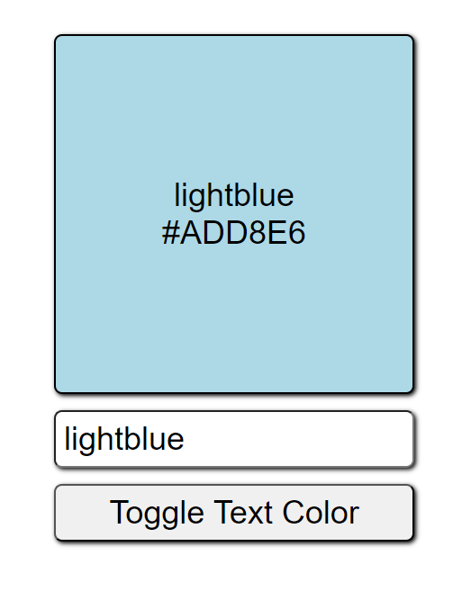

# ReactJS Box Color Project

ReactJS Box Color Project
Welcome to the ReactJS Box Color Project! This repository serves as a learning ground for React concepts, including useState, controlled inputs, lists, and keys.

## Project Overview

## Demo

### App Component

The App component acts as the central controller, managing state variables and rendering the Square and Input components.

### Input Component
The Input component facilitates user input for color names, updating state variables. It also provides a button to toggle text color.

### Square Component
The Square component displays a colored square with the specified color name and its hexadecimal value. Text color dynamically adjusts based on user interaction.

## What I learned

Throughout this project, key React concepts were explored, including:

- 1. useState: Managing state variables for color-related information.
- 2. Controlled Inputs: Creating input fields as controlled components.
- 3. Lists and Keys: Enhancing performance and rendering efficiency through proper key usage.

## License

This project is licensed under the MIT License - see the LICENSE.md file for details.

